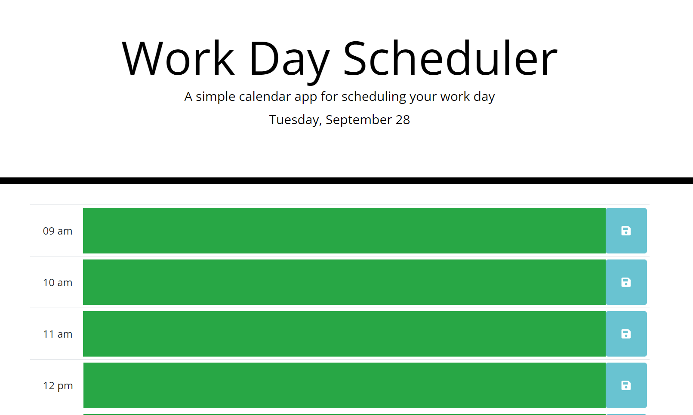
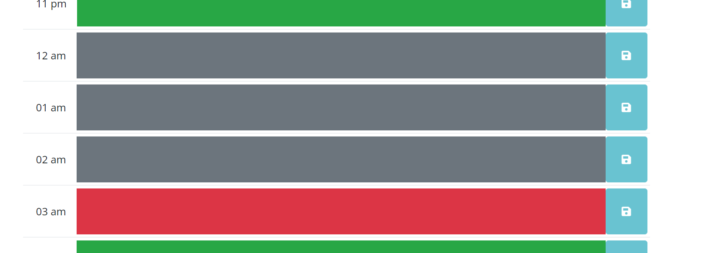
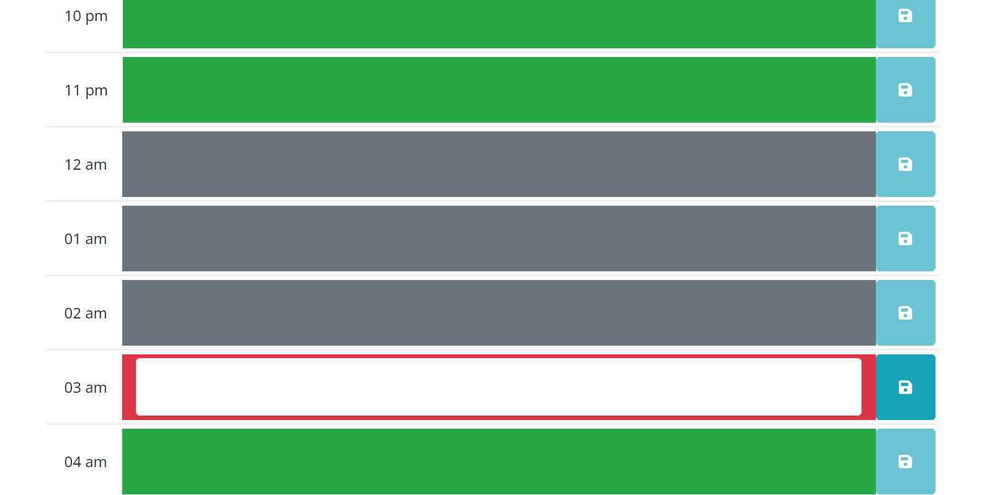
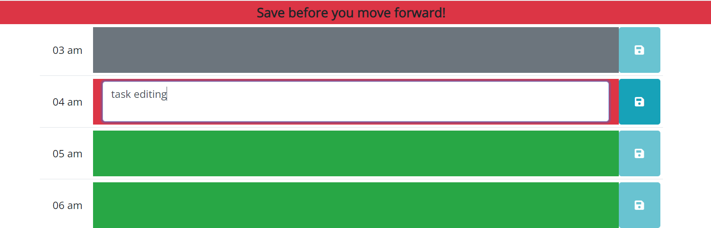

# schedule-reminder

## Link to Application
Click on link to see the deployed website [https://sehaj97.github.io/schedule-reminder/](https://sehaj97.github.io/schedule-reminder/)

## Description
simple calendar application that allows a user to save events for each hour of the day. 

This app will run in the browser and feature dynamically updated HTML and CSS powered by jQuery, bootstrap and momentjs.

## Screenshots

### screenshot when page loads

### screenshot for color coded timeblocks

### screenshot for edit and save updates

### screenshot for error message if you try to edit before saving

